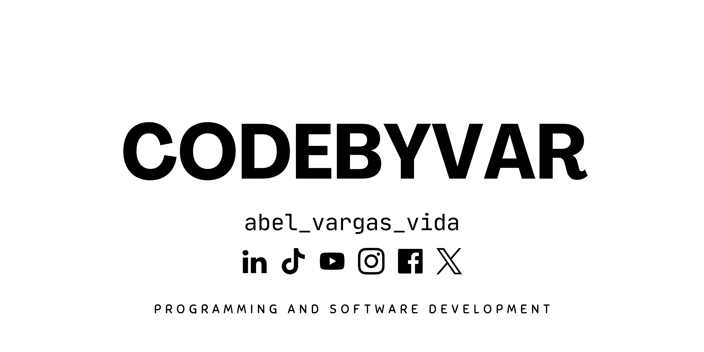

# 👋 Hola, soy Abel Vargas | CodeByVar

  <h1>Bienvenido a mi portafolio digital</h1>

  

  
💻 Desarrollador Full Stack en formación | Apasionado por la tecnología y la innovación

  

    
    <a href="https://www.linkedin.com/in/abel-vargas-96388618a" target="_blank">🔗 LinkedIn</a> • 
    <a href="https://github.com/CodeByVar" target="_blank">🐙 GitHub</a>
  

---

## 🚀 Sobre mí

- Estudiante de Ingeniería en Sistemas.
- Me encanta crear soluciones eficientes y aprender nuevas tecnologías.
- Actualmente explorando Full Stack Development con proyectos en Python, PHP, JavaScript y más.
- Apasionado por el software libre y la comunidad tech.

---

## 🌟 Proyectos destacados

| Proyecto                         | Descripción                                        | Link                                     |
|---------------------------------|--------------------------------------------------|------------------------------------------|
| Sistema de Inventarios           | Gestión web de inventarios en mercados.          | [GitHub](https://github.com/kodigo345/ProyectoInventarios) |
| Verificación de permisos         | Sistema con reconocimiento facial para permisos. | [GitHub](https://github.com/kodigo345/VerificacionPermisos) |
| Página personal                  | Mi sitio web personal con blog y portafolio.     | [GitHub](https://github.com/kodigo345/PersonalSite)         |

---

## 📫 Contáctame

Si quieres platicar o colaborar en proyectos, aquí estoy:

- 📧 abel.tucorreo@gmail.com  
- 🔗 [LinkedIn](https://www.linkedin.com/in/abelvargas)  
- 🐙 [GitHub](https://github.com/kodigo345)

---

## ⚡ Tech Stack

  
  
  
  
  
  

---

¡Gracias por visitar mi perfil! 🙌

---

<!--
Puedes usar [README Profile Generator](https://rahuldkjain.github.io/gh-profile-readme-generator/) para personalizar más si quieres.
-->
